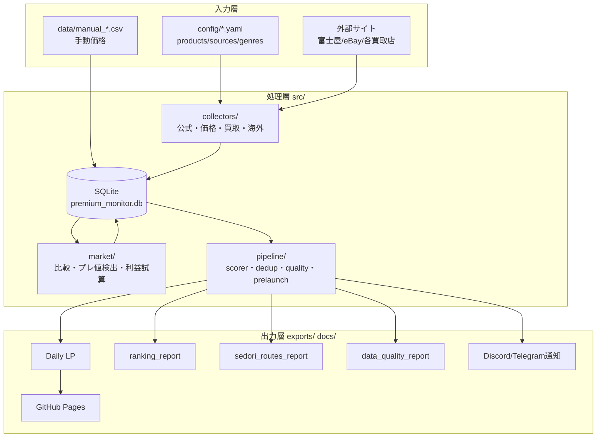
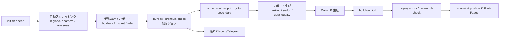
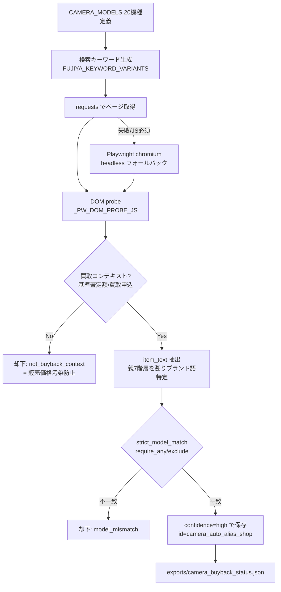
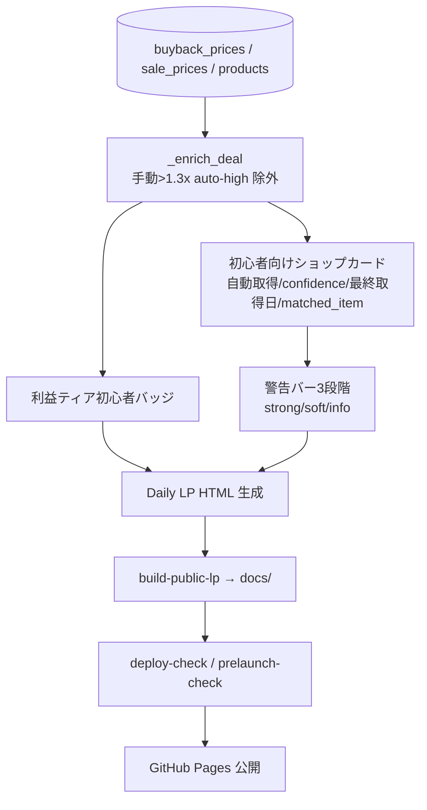
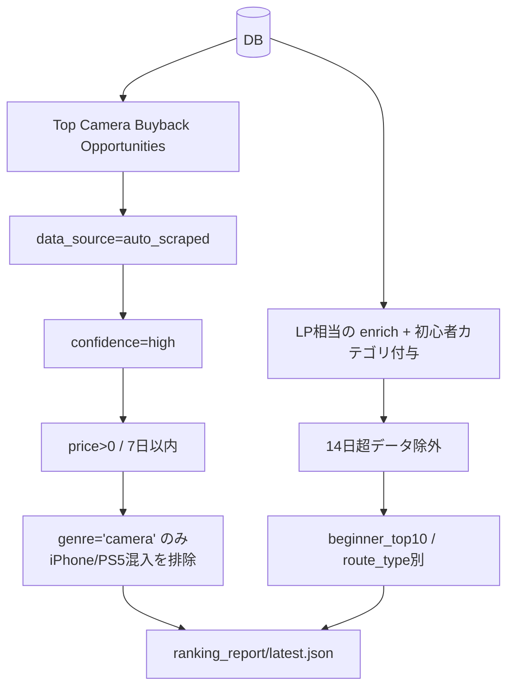
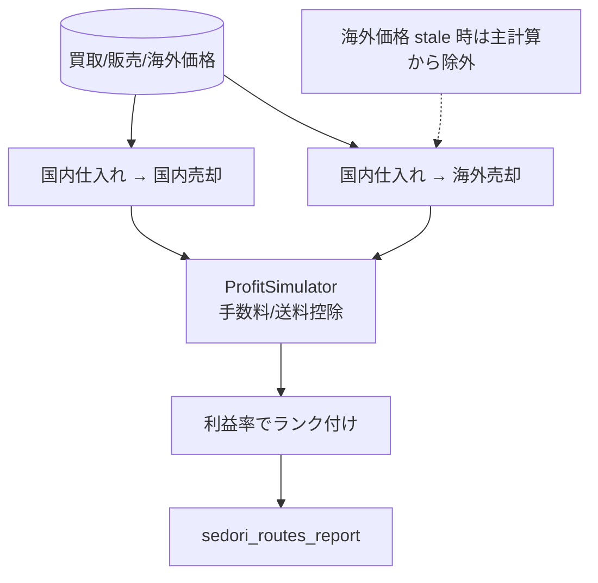
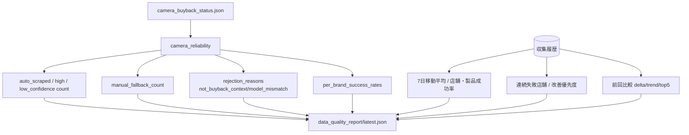
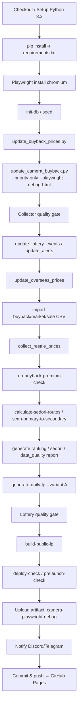

# System Overview — プレ値商品監視・速報システム（premium-monitor）

## 0. システムの目的と安全制約

iPhone / Apple製品 / カメラ / ゲーム機を対象に、**公式価格・中古価格・買取価格・海外価格**を横断監視し、
プレ値（プレミア価格）候補を検出・比較・通知し、**LP（ランディングページ）を自動生成**するシステム。

> **絶対禁止（CLAUDE.md由来）**: 自動購入・自動応募・CAPTCHA突破・ログイン突破・複数アカウント運用・高頻度アクセス・規約違反行為。
> 本システムは **情報の収集・比較・通知・LP生成のみ**を行う。

## 1. システム全体構成

```
config/           設定 (products.yaml, sources.yaml, genres.yaml, lp_settings.yaml, fx_rates.yaml ...)
data/             SQLite DB (premium_monitor.db) + 手動CSV (manual_buyback/market/sale_prices.csv)
src/
  cli.py          全CLIコマンド (~2300行)
  scheduler.py    APScheduler (買取ジョブ + 在庫)
  orchestrator.py 全体オーケストレーション
  collectors/     公式 / price / stock / buyback / overseas Collector
  db/             Database, Repository, migrations/
  models/         Pydantic モデル
  market/         MarketComparator, PremiumDetector, BeginnerDealScanner, ProfitSimulator
  pipeline/       Scorer, Dedup, AlertDispatcher, QualityChecker, PrelaunchChecker
  content/        DailyLPGenerator, NoteGenerator, LINE/Community MessageGenerator
  notifiers/      Log / Discord / Telegram + routing
scripts/          収集・レポート生成・品質チェック・デプロイチェック
exports/          生成物 (lp/daily, ranking_report, data_quality_report, sedori_routes_report ...)
docs/             GitHub Pages 公開用
.github/workflows/daily_lp.yml   日次自動更新
```



## 2. データフロー（全体）



## 3. スクレイピングフロー（買取・カメラ）

中核は `scripts/update_camera_buyback.py`（富士屋カメラ買取）。



**精度保証の要点**
- `near_buyback` ゲート: 「基準査定額/査定/買取申し込み」文脈の価格のみ採用（販売カタログ価格を排除）。
- 厳格モデル一致: ILCE/ILME 型番固定（Sony）、Mark III 除外（Canon）等で誤マッチ排除。
- `confidence=high` のみ自動採用。一致しなければ手動フォールバック。
- 取得元の現実: Mapcamera=Akamaiブロック、Kitamura=site_blocked、富士屋=稼働中。

## 4. LP生成フロー

`src/content/daily_lp_generator.py` → `build-public-lp` → `docs/`（GitHub Pages）。



## 5. ranking生成フロー

`scripts/generate_ranking_report.py` → `exports/ranking_report/latest.json|md`。



## 6. sedori生成フロー

`python -m src.cli calculate-sedori-routes` →
`scripts/generate_sedori_routes_report.py` → `exports/sedori_routes_report/`。



## 7. data_quality生成フロー

`scripts/generate_data_quality_report.py` → `exports/data_quality_report/latest.json|md`。



## 8. GitHub Actions実行フロー（daily_lp.yml）

- トリガー: `cron: '0 3 * * *'`（UTC 03:00 = JST 12:00）+ 手動 `workflow_dispatch`。
- 所要: 約50–80分（20機種カメラ収集 + Playwright導入時で80分）。



**Secrets（実値はリポジトリ外・GitHub Secrets管理）**
`EBAY_APP_ID` / `DISCORD_WEBHOOK_URL` / `TELEGRAM_BOT_TOKEN` / `TELEGRAM_CHAT_ID`（未設定でも動作・精度低下のみ）。
